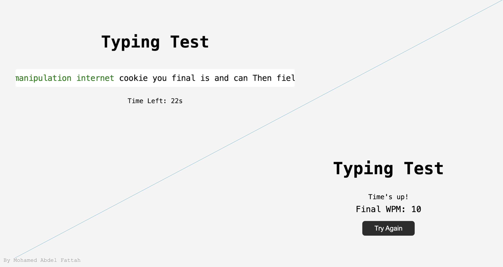

# ⌨️ Typing Speed Test

A simple **Typing Speed Test** web app built with **HTML**, **CSS**, and **JavaScript**.  
Test your typing speed and accuracy in real-time with a countdown timer and live error highlighting.

---

## 📸 Screenshot



---

## 🎯 Features

- 🕑 **60-second countdown timer**
- ✍️ **Real-time typing feedback** (correct / wrong character highlighting)
- ✅ **Final WPM (Words Per Minute) calculation**
- 🔁 **Try Again button** to restart the test
- 📱 **Responsive Design**

---

## 🌐 Live Demo

[🔗 Click here to try it online](https://typing-test-000speed.netlify.app/)

---

## 🛠️ Built With

- HTML5  
- CSS3  
- JavaScript (Vanilla JS)

---

## 📥 How to Run Locally

1. **Clone the repository:**
   ```bash
   git clone https://github.com/MohamedAftah004/typing-test.git
